## Die Schritte, die du zum Einrichten des GitHub-Repositorys "MeinProjekt" durchgeführt hast.

### 1. Gehe zu GitHub (www.github.com) und melde dich mit deinem Benutzerkonto an. Falls du noch kein Konto hast, registriere dich kostenlos.

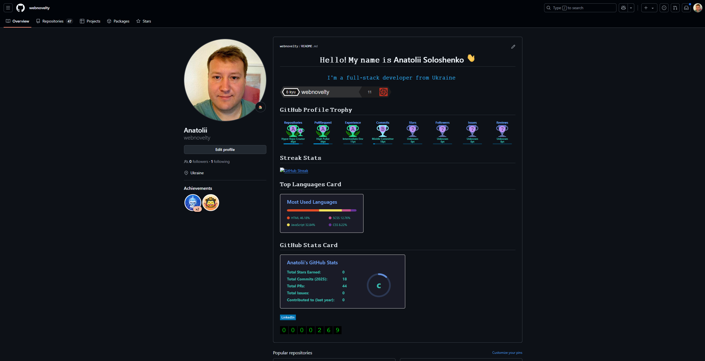

### 2. Nach dem Login klicke auf "+ New" (oben rechts) und erstelle ein neues leeres Repository mit dem Namen "MeinProjekt".

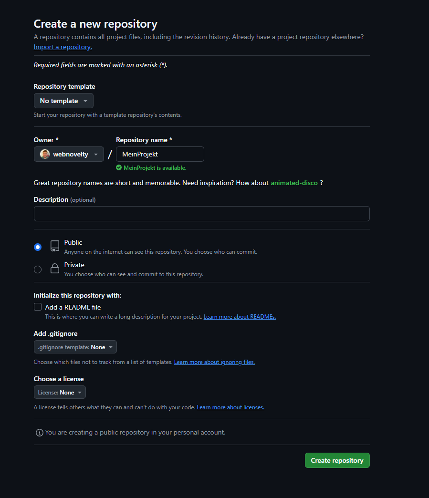

### 3. Notiere dir die URL des erstellten Repositories, sie wird später benötigt.

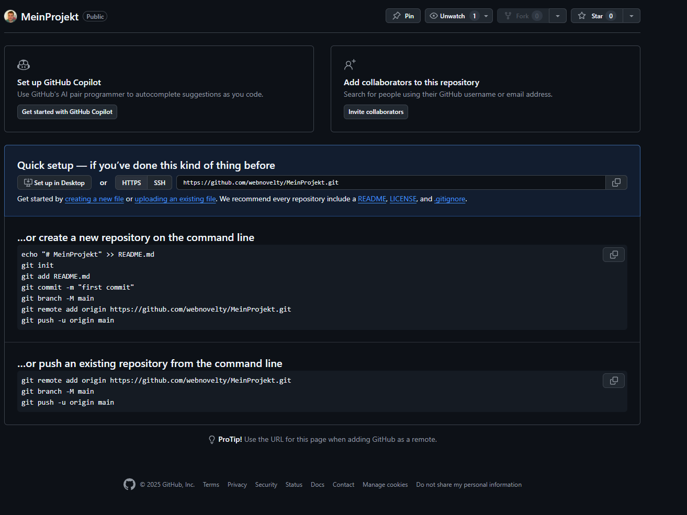

## Die Schritte, die du zum Erstellen eines SSH-Schlüssels (falls du keinen bereits hattest) durchgeführt hast.

### 4. Öffne dein Terminal (Linux/Mac) oder Git Bash (Windows).

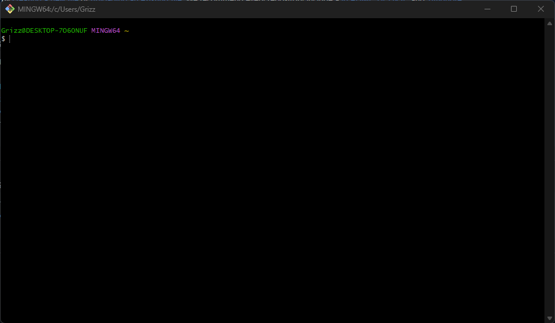

### 5. Überprüfe, ob du bereits einen SSH-Schlüssel hast, indem du den folgenden Befehl ausführst: ls ~/.ssh/

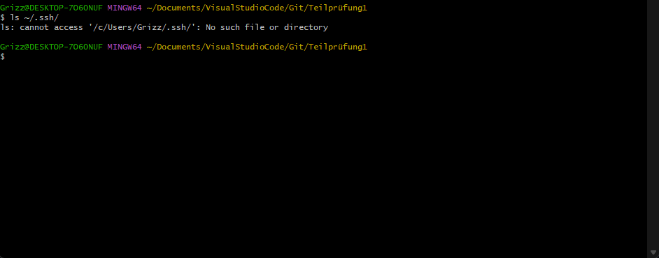

### 6. Falls die Ausgabe Dateien wie id_rsa und id_rsa.pub enthält, hast du bereits einen SSH-Schlüssel. In diesem Fall kannst du zu Teil 3 springen. Wenn die Dateien nicht existieren, erstelle einen neuen SSH-Schlüssel mit dem folgenden Befehl: bash ssh-keygen -t rsa -b 4096 -C "deine_email@beispiel.com" Beachte, dass "deine_email@beispiel.com" durch deine GitHub-E-Mail-Adresse ersetzt werden muss.

### 7. Der Befehl wird dich nach dem Speicherort des Schlüssels fragen und optional nach einem Passwort. Du kannst den Standard-Speicherort akzeptieren und ein Passwort festlegen oder es leer lassen (kein Passwort).

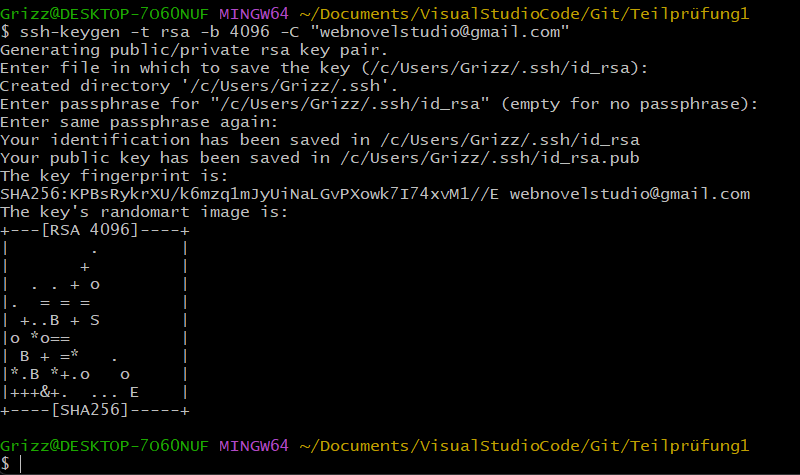

### ---

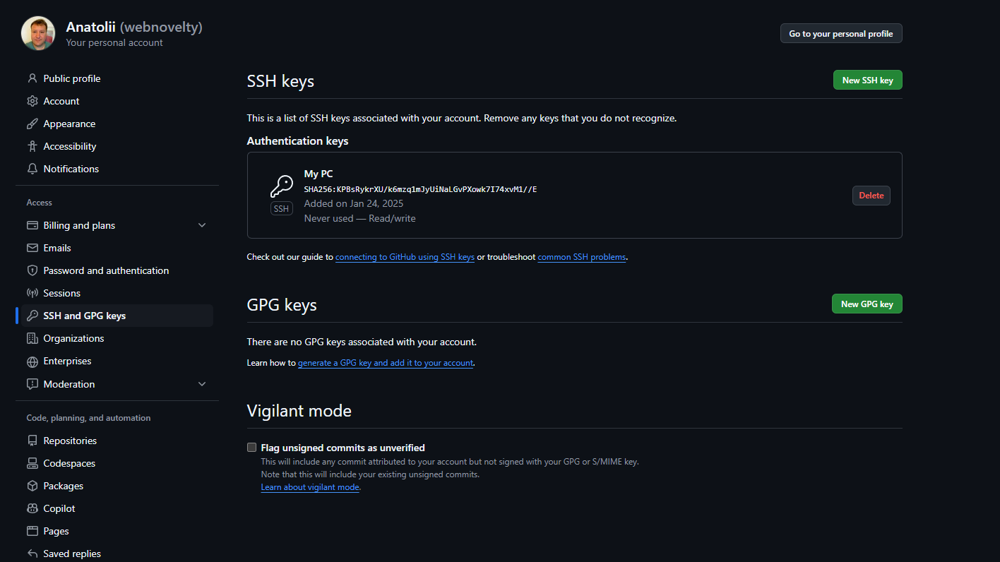

### ---

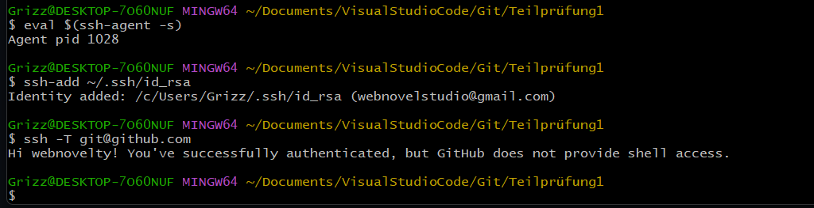

## Die Schritte, die du zum lokalen Klonen des Repositorys, zum Konfigurieren von Git und zum Erstellen der initialen Commits durchgeführt hast.

### 8. Gehe in deinem Terminal zu dem Verzeichnis, in dem du dein lokales Git-Repository erstellen möchtest.

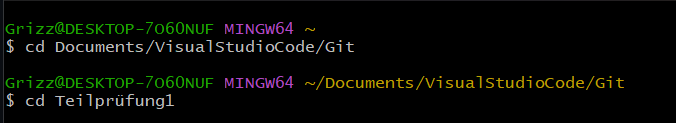

### 9. Klone das GitHub-Repository "MeinProjekt" mit dem folgenden Befehl: bash git clone git@github.com:DeinBenutzername/MeinProjekt.git .Ersetze "DeinBenutzername" durch deinen GitHub-Benutzernamen. Der Befehl klont das Repository auf deinen lokalen Rechner.

### 10. Navigiere in das geklonte Verzeichnis "MeinProjekt":

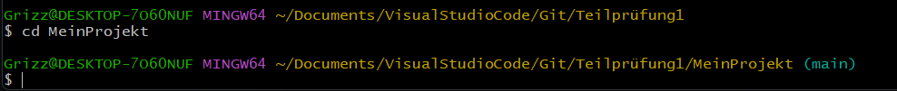

### 11. Konfiguriere Git mit deinem Namen und E-Mail, die mit GitHub verknüpft sind:

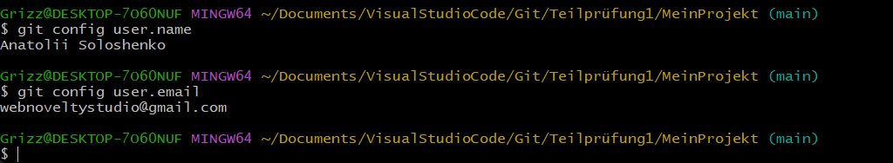

### 12. Füge eine neue Datei hinzu (z. B. "main.py") und erstelle einen Initial-Commit:

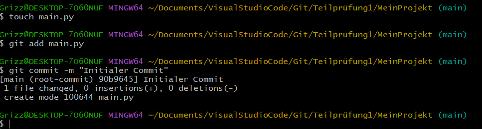

## Die Schritte, die du zum Erstellen des "feature"-Branches, zum Hinzufügen einer neuen Datei zu diesem Branch und zum Committen der Änderungen durchgeführt hast.

### 13. Erstelle einen neuen Branch mit dem Namen "feature":

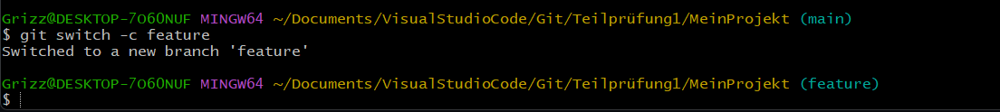

### 14. Füge eine weitere Datei hinzu (z. B. "utils/database.py") und erstelle einen Commit auf dem "feature"-Branch:

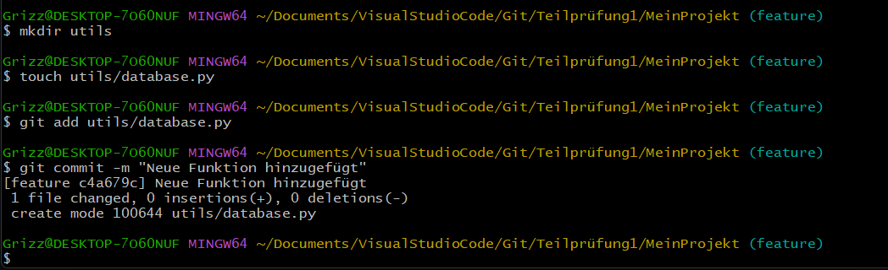

### 15. Bearbeite die Datei "main.py" und führe einen Commit auf dem "feature"-Branch durch:

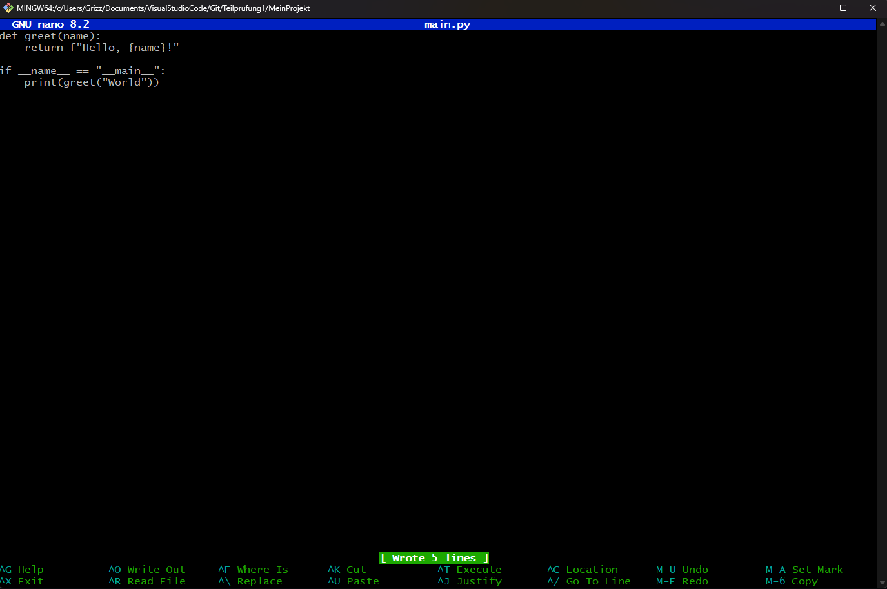

### ---

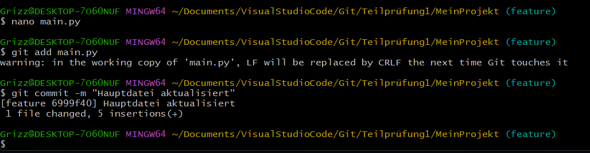

## Die Schritte, die du zum Mergen des "feature"-Branches in den "master"-Branch und zum Beheben des dabei auftretenden Merge-Konflikts durchgeführt hast.

### 16. Wechsle zurück zum "master"-Branch:

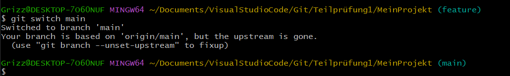

### 17. Bearbeite die Datei "main.py" und führe einen Commit auf dem "master"-Branch durch:

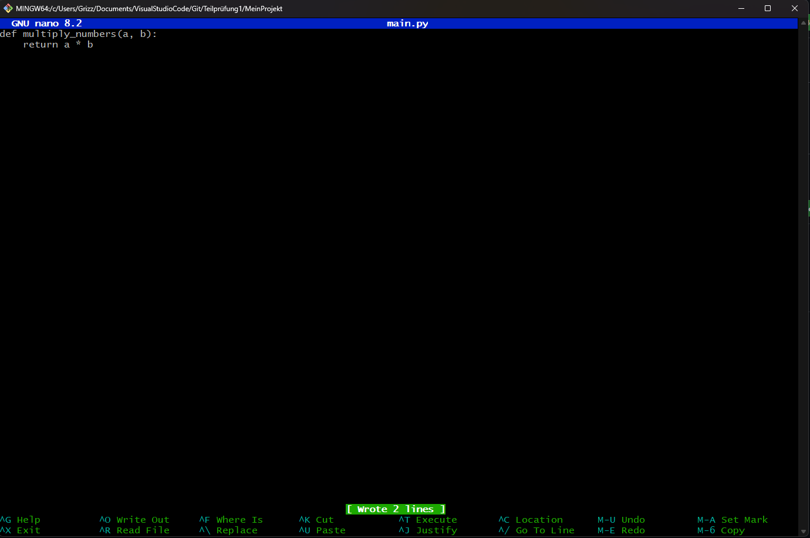

### ---

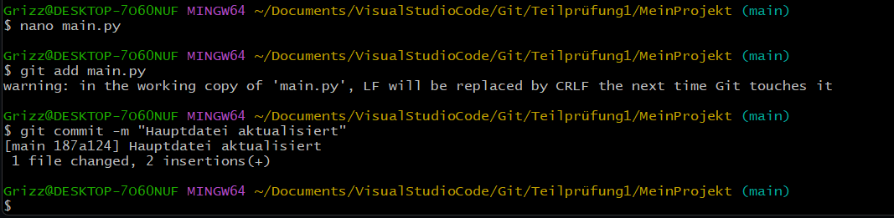

### 18. Versuche nun den "feature"-Branch in den "master"-Branch zu mergen:

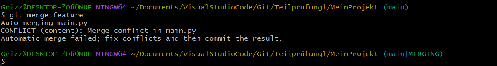

### ---

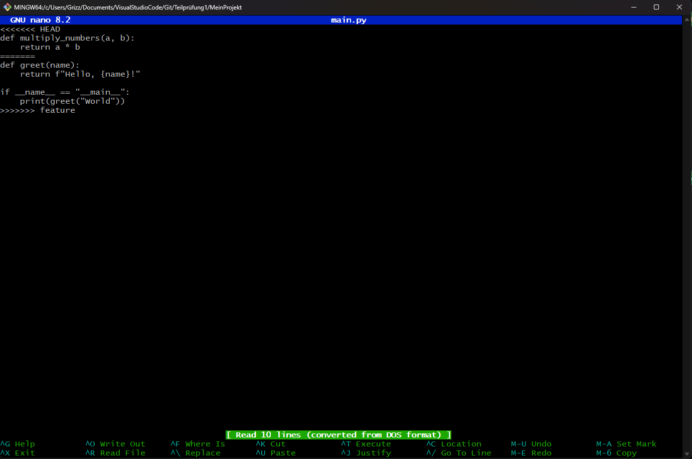

### ---

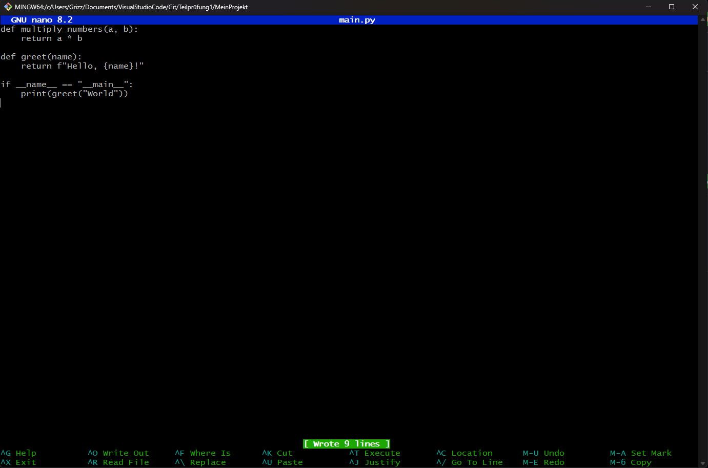

### ---

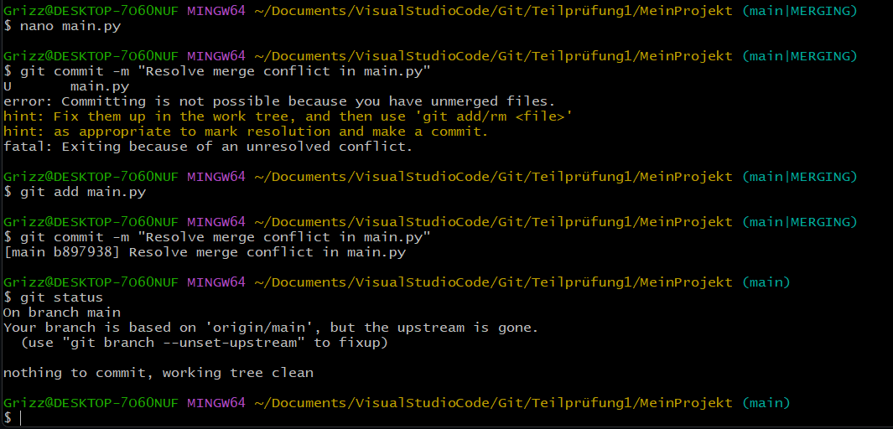
